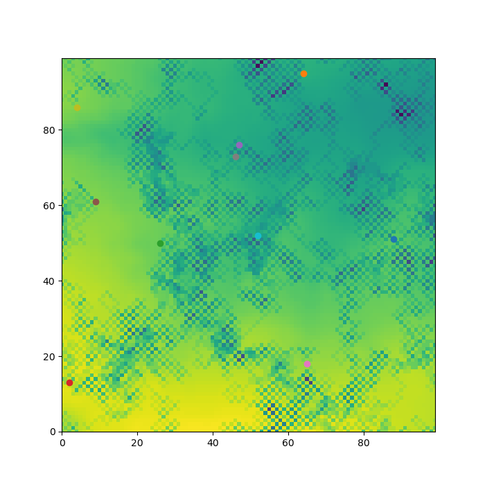

<!--
 * @Author: your name
 * @Date: 2021-01-26 14:49:25
 * @LastEditTime: 2021-05-08 16:52:55
 * @LastEditors: Please set LastEditors
 * @Description: In User Settings Edit
 * @FilePath: \ethan20201996.github.io\index.md
-->

# GEOG 5990

---

# GEOG 5990 Portfolio

## Discription

This model includes each basic part of practical: 
&nbsp;&nbsp;_ builds agents in a space; 
&nbsp;&nbsp;_ gets them to interact with each other; 
&nbsp;&nbsp;_ reads in environmental data; 
&nbsp;&nbsp;_ gets agents to interact with the environment; 
&nbsp;&nbsp;_ randomizes the order of agent actions; 
&nbsp;&nbsp;_ displays the model as an animation; 
&nbsp;&nbsp;_ is contained within a GUI; 
&nbsp;&nbsp;_ is initialised with data from the web. 
Addionally, I modified the model to let agent eat fast if they have more store, I made a self.speed label in **init** method to control the iteration of store: 
def eat(self): 
if self.environment[self.y][self.x] > 10: 
self.environment[self.y][self.x] -= 10 
self.store = self.store + 10 + self.speed 
if self.store > 4000: 
self.speed += 100 
The final canvas will output as a png file  

### Final result:

## Link below:

<a href="https://raw.githubusercontent.com/ethan20201996/ethan20201996.github.io/main/model.py">Model<a>
<a href="https://raw.githubusercontent.com/ethan20201996/ethan20201996.github.io/main/agentframework.py">Framework<a>

## Resume

<a href="https://ethan20201996.github.io/homepage.html">On the way......<a>
